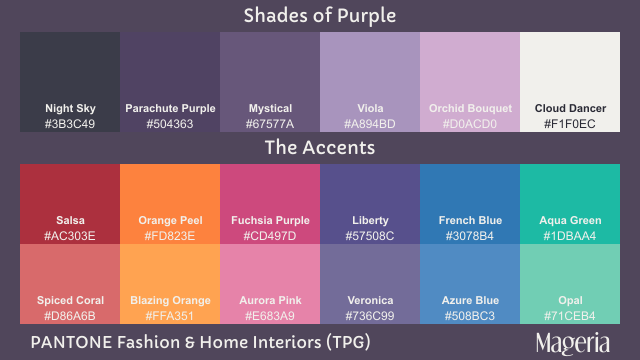

# Mageria Color Palette

**Mageria** (or formally as "Hi-Mageria") is a color palette inspired from magic & mystical color palette, with purple as primary color & has 6 accent color (with shades). Mageria color palette is 100% based from **PANTONE® Fashion, Home + Interiors (FHI)** color palette, with most colors based on **FHI Paper TPG _(Lacquer Coating on Paper)_** except black (based on **FHI Cotton TCX _(Dye on Cotton Fabric)_** for blackness).

This color palette can be used for design, art, and even in development world, for example Base16 & terminal color scheme, which designed for terminal & syntax highlighting.

## General Color Information

Generally, Mageria color palette divided into 3 sections:

1. Shades of Purple:
   -  Night Sky
   -  Purple Velvet (TCX)/Parachute Purple (TPG)
   -  Mystical
   -  Viola
   -  Orchid Bouquet
   -  Cloud Dancer
2. Accents:
   -  Salsa & Spiced Coral (red)
   -  Orange Peel & Blazing Orange (orange)
   -  Fuchsia Purple & Aurora Pink (pink)
   -  Liberty & Veronica (purple)
   -  French Blue & Azure Blue (blue)
   -  Aqua Green & Opal (cyan)
3. Additional colors (especially in art design or palette with missing hue/shade range):
   -  Purple Magic (main accent)
   -  Green Glow & Acid Green (green)
   -  Dandelion & Illuminating (yellow)
   -  Rabbit & Purple Ash (gray)
   -  Pink-A-Boo (will be included as shades in Mageria v2)

### Shades of Purple

PANTONE® FHI TCX (Lacquer Coating on Paper)

PANTONE® FHI TPG (Dye on Cotton Fabric)

| No  | Color | PANTONE CODE | Color Name | TCX RGB Hex | TPG RGB Hex |
| :-: | ----- | ------------ | ---------- | :---------: | :---------: |
| 1. |  | 19-3924 TCX/TPG | Night Sky | #2A2A35 | #3B3C49 |
| 2a. |  | 19-3731 TCX/**TPG** | Parachute Purple | #392852 | #504363 |
| 2b. |  | 19-3725 **TCX**/TPG | Purple Velvet | #41354D | #50465B |
| 3. |  | 18-3620 TCX/TPG | Mystical | #5F4E72 | #67577A |
| 4. |  | 16-3815 TCX/TPG | Viola | #A692BA | #A894BD |
| 5. |  | 15-3412 TCX/TPG | Orchid Bouquet | #D1ACCE | #D0ACD0 |
| 6. |  | 11-4201 TCX/TPG | Cloud Dancer | #F0EEE9 | #F1F0EC |

Additional shades

| No  | Color | PANTONE CODE | Color Name | TCX RGB Hex | TPG RGB Hex |
| :-: | ----- | ------------ | ---------- | :---------: | :---------: |
| 1. |  | 19-3905 | Rabbit | #5f575d | #5e5a5e |
| 2. |  | 17-3810 | Purple Ash | #8f8395 | #8e8698 |
| 3. |  | 13-2801 | Pink-A-Boo | #f7cddb | #f6cfdd |

### Accents

PANTONE® FHI TCX (Lacquer Coating on Paper)

PANTONE® FHI TPG (Dye on Cotton Fabric)

| No  | Color | PANTONE CODE | Color Name | TCX RGB Hex | TPG RGB Hex |
| :-: | ----- | ------------ | ---------- | :---------: | :---------: |
| 1. |  | 18-1657 TCX/TPG | Salsa | #AA182B | #AC303E |
|    |  | 17-1644 TCX/TPG | Spiced Coral | #D75C5D | #D86A6B |
| 2. |  | 16-1359 TCX/TPG | Orange Peel | #FA7A35 | #FD823E |
|    |  | 15-1160 TCX/TPG | Blazing Orange | #FFA74F | #FFA351 |
| 3. |  | 18-2436 TCX/TPG | Fuchsia Purple | #D4367A | #CD497D |
|    |  | 15-2217 TCX/TPG | Aurora Pink | #E881A6 | #E683A9 |
| 4. |  | 19-3850 TCX/TPG | Liberty | #4E4489 | #57508C |
|    |  | 18-3834 TCX/TPG | Veronica | #6D6695 | #736C99 |
| 5. |  | 18-4140 TCX/TPG | French Blue | #0072B5 | #3078B4 |
|    |  | 17-4139 TCX/TPG | Azure Blue | #4D91C6 | #508BC3 |
| 6. |  | 15-5421 TCX/TPG | Aqua Green | #00B89F | #1DBAA4 |
|    |  | 14-5718 TCX/TPG | Opal | #77CFB7 | #71CEB4 |

## Color Palette Variants

This color palette has 3 variants, where basis color are based on **PANTONE® FHI TPG**, but available in **PANTONE® FHI TCX** & **Formula Guide** as well.

### PANTONE® Fashion, Home + Interiors TPG (Lacquer Coating on Paper)

   

      
      
      
      
      
      
   

   

      
      
      
      
      
      
   

   

      
      
      
      
      
      
   

### PANTONE® Fashion, Home + Interiors TCX (Dye on Cotton Fabric)

   

      
      
      
      
      
      
   

   

      
      
      
      
      
      
   

   

      
      
      
      
      
      
   

## Mageria: in programming & development world

**Mageria** color scheme is first terminal color 100% based from **PANTONE® Fashion, Home + Interiors (FHI)** System, with most colors based on FHI Paper TPG (Lacquer Coating on Paper) except black (based on FHI Cotton TCX (Dye on Cotton Fabric) for blackness). Each colors represents PANTONE® FHI number with following colorname as follows:

| Color ID | Color Name | PANTONE Color |
| :------: | ---------- | ------------- |
| 0 | Black | 19-3924 TCX Night Sky |
| 1 | Red | 18-1657 TPG Salsa |
| 2 | Green | 16-1359 TPG Orange Peel |
| 3 | Yellow | 18-2436 TPG Fuchsia Purple |
| 4 | Blue | 19-3850 TPG Liberty |
| 5 | Purple | 18-4140 TPG French Blue |
| 6 | Cyan | 15-5421 TPG Aqua Green |
| 7 | Light Gray | 15-3412 TPG Orchid Bouquet |
| 8 | Dark Gray | 18-3620 TPG Mystical |
| 9 | Light Red | 17-1644 TPG Spiced Coral |
| 10 | Light Green | 15-1160 TPG Blazing Orange |
| 11 | Light Yellow | 15-2217 TPG Aurora Pink |
| 12 | Light Blue | 18-3834 TPG Veronica |
| 13 | Light Purple | 17-4139 TPG Azure Blue |
| 14 | Light Cyan | 14-5718 TPG Opal |
| 15 | White | 11-4201 TPG Cloud Dancer |

Also, the Base16 colorscheme version is adapted from PANTONE FHI System too, with represented Base16 colorlist as follows:

| Base16 color | Color Preview | PANTONE Color |
| :----------: | :-----------: | ------------- |
| base00 |  | *darkened version of 19-3924 TCX* |
| base01 |  | 19-3924 TCX night sky |
| base02 |  | 19-3725 TPG parachute purple |
| base03 |  | 18-3620 TPG mystical |
| base04 |  | 16-3815 TPG viola |
| base05 |  | 15-3412 TPG orchid bouquet |
| base06 |  | 12-2102 TPG mauve morn/13-3405 TPG Lilac Snow |
| base07 |  | 11-4201 TPG cloud dancer |
| base08 |  | 17-1463 TCX tangerine tango |
| base09 |  | 16-1359 TPG orange peel |
| base0A |  | 13-0758 TPG dandelion |
| base0B |  | 14-0340 TPG acid lime |
| base0C |  | 14-6330 TPG spring bud |
| base0D |  | 15-5421 TPG aqua green |
| base0E |  | 15-2217 TPG aurora pink |
| base0F |  | 18-4140 TPG french blue |

## Base16 colorschemes

YAML [(hi-mageria.yaml)](base16/hi-mageria/hi-mageria.yaml) | SASS/SCSS [(hi-mageria.scss)](base16/hi-mageria/hi-mageria.scss)

Available for use with syntax highlighting. Perfect to use with your favourite text editors, IDE, and code previewer (rouge and highlight.js).

Color grid:

Color preview:

## Credits

PANTONE® and related trademarks are the property of [Pantone LLC](https://www.pantone.com), a division of [X-Rite](https://www.xrite.com), a [Danaher](https://www.danaher.com) company.

The choosen colors are used for reference for digital art with sRGB color profile, and may differ on print or display in other display devices (e.g. monitor, tablet, notebook, smartphone, TV, etc.)
